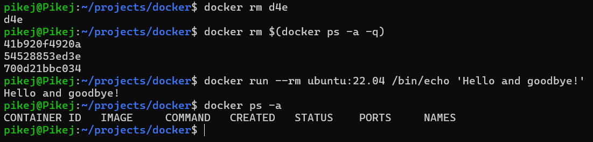
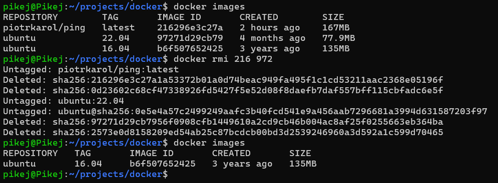

# Basic docker trainings

---

### Spis treści:
* [Zadanie 1](#zadanie-1)
* [Zadanie 2](#zadanie-2)
* [Zadanie 3](#zadanie-3)
* [Zadanie 4](#zadanie-4)
* [Zadanie 5](#zadanie-5)

---
## Zadanie 1
zrzut ekranu 1

zrzut ekranu 2

zrzut ekranu 3

zrzut ekranu 4

zrzut ekranu 5

zrzut ekranu 6

zrzut ekranu 7

zrzut ekranu 8

zrzut ekranu 9

zrzut ekranu 10

zrzut ekranu 11

zrzut ekranu 12

zrzut ekranu 13

zrzut ekranu 14

zrzut ekranu 15

zrzut ekranu 16

zrzut ekranu 17

zrzut ekranu 18

zrzut ekranu 19

zrzut ekranu 20

zrzut ekranu 21

zrzut ekranu 22

zrzut ekranu 23

---
## Zadanie 2
zrzut ekranu 1

zrzut ekranu 2

zrzut ekranu 3

zrzut ekranu 4

zrzut ekranu 5

zrzut ekranu 6

zrzut ekranu 7

---
## Zadanie 3
zrzut ekranu 1

zrzut ekranu 2

zrzut ekranu 3

zrzut ekranu 4

zrzut ekranu 5

zrzut ekranu 6

zrzut ekranu 7

zrzut ekranu 8

---
## Zadanie 4
zrzut ekranu 1

zrzut ekranu 2

zrzut ekranu 3

---
## Zadanie 5
zrzut ekranu 1

zrzut ekranu 2

zrzut ekranu 3

zrzut ekranu 4

zrzut ekranu 5

---
## Zadanie 6
zrzut ekranu 1

zrzut ekranu 2

zrzut ekranu 3

zrzut ekranu 4

zrzut ekranu 5

zrzut ekranu 6

zrzut ekranu 7

**!BŁĄD!** zrzut ekranu 8

**!BŁĄD!** zrzut ekranu 9

