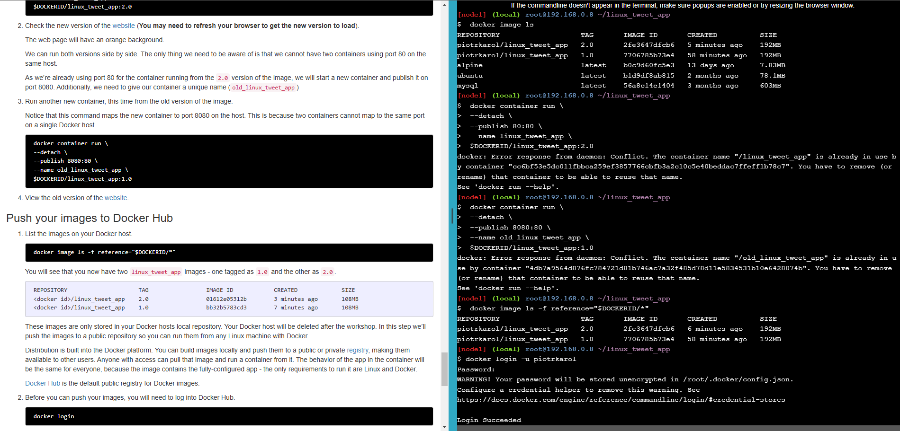
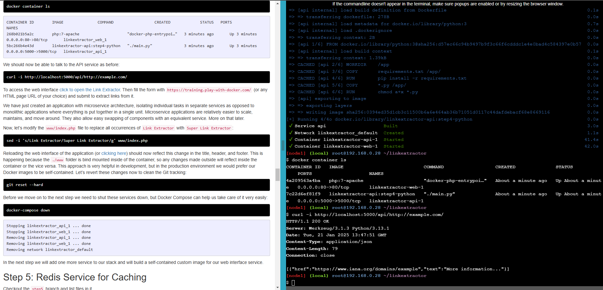

# Play with docker trainings 
Zrzuty ekranu ze strony https://training.play-with-docker.com/

Wybrana ścieżka: **Getting Started Walk-through for Developers**

---
## Spis treści:
* [Docker for Beginners - Linux](#docker-for-beginners---Linux)
  * [Task 0: Prerequisites](#task-0-prerequisites)
  * [Task 1: Run some simple Docker containers](#task-1-run-some-simple-docker-containers)
  * [Task 2: Package and run a custom app using Docker](#Task-2-Package-and-run-a-custom-app-using-Docker)
  * [Task 3: Modify a running website](#Task-3-Modify-a-running-website)
* [Application Containerization and Microservice Orchestration](#Application-Containerization-and-Microservice-Orchestration)
  * [Stage Setup](#Stage-Setup)
  * [Step 0: Basic Link Extractor Script](#Step-0-Basic-Link-Extractor-Script)
  * [Step 1: Containerized Link Extractor Script](#Step-1-Containerized-Link-Extractor-Script)
  * [Step 2: Link Extractor Module with Full URI and Anchor Text](#Step-2-Link-Extractor-Module-with-Full-URI-and-Anchor-Text)
  * [Step 3: Link Extractor API Service](#Step-3-Link-Extractor-API-Service)
  * [Step 4: Link Extractor API and Web Front End Services](#Step-4-Link-Extractor-API-and-Web-Front-End-Services)
  * [Step 5: Redis Service for Caching](#Step-5-Redis-Service-for-Caching)
  * [Step 6: Swap Python API Service with Ruby](#Step-6-Swap-Python-API-Service-with-Ruby)
* [Deploying a Multi-Service App in Docker Swarm Mode](#Deploying-a-Multi-Service-App-in-Docker-Swarm-Mode)
  * [Swarm init](#Swarm-init)
  * [Clone repository and deploy a stack](#Clone-repository-and-deploy-a-stack)

---
## Docker for Beginners - Linux
### Task 0: Prerequisites
zrzut ekranu 1:

### Task 1: Run some simple Docker containers
zrzut ekranu 1:

zrzut ekranu 2:

zrzut ekranu 3:

### Task 2: Package and run a custom app using Docker
zrzut ekranu 1:

zrzut ekranu 2:

### Task 3: Modify a running website
zrzut ekranu 1:

zrzut ekranu 2:

zrzut ekranu 3:

---
## Application Containerization and Microservice Orchestration
**Note:** Podczas realizacji poniższych zadań wielokrotnie wyskakiwał błąd odnośnie zamknięcia sesji terminala. 
Uniemożliwiało to kontynuację zadań i musiałem zaczynać od nowa.
Błąd ten najczęściej pojawiał się przy realizacji komendy `curl -i http://localhost:5000/api/http://example.com/`.
Realnie zadania byłem w stanie rozwiązać dopiero za 5 podejściem. 
Dodatkowo za każdym podejściem kolejne polecenia dockera związane z budowaniem 
zajmowały każdorazowo coraz więcej czasu (300 sekund i więcej), 
po czym i tak zdarzało się że pokazywał się komunikat odnośnie zamknięcia terminala i terminacji sesji.  
### Stage Setup
zrzut ekranu 1:

### Step 0: Basic Link Extractor Script
zrzut ekranu 1:

### Step 1: Containerized Link Extractor Script
zrzut ekranu 1:

zrzut ekranu 2:

zrzut ekranu 3:

### Step 2: Link Extractor Module with Full URI and Anchor Text
zrzut ekranu 1:

zrzut ekranu 2:

zrzut ekranu 3:

### Step 3: Link Extractor API Service
zrzut ekranu 1:

zrzut ekranu 2:

zrzut ekranu 3:

### Step 4: Link Extractor API and Web Front End Services
zrzut ekranu 1:

zrzut ekranu 2:

zrzut ekranu 3:

zrzut ekranu 4:

zrzut ekranu 5:

zrzut ekranu 6:

zrzut ekranu 7:

### Step 5: Redis Service for Caching
zrzut ekranu 1:

zrzut ekranu 2:

zrzut ekranu 3:

zrzut ekranu 4:

zrzut ekranu 5:

zrzut ekranu 6:

### Step 6: Swap Python API Service with Ruby
zrzut ekranu 1:

zrzut ekranu 2:

zrzut ekranu 3:

zrzut ekranu 4:

zrzut ekranu 5:

---
## Deploying a Multi-Service App in Docker Swarm Mode
### Swarm init
zrzut ekranu 1:

### Clone repository and deploy a stack
**Note:** pomimo wykonania zadań dokładnie jak na instrukcji 
zadanie i tak zakończyło się niepowodzeniem, co widać na ostatnim zrzucie ekranu

zrzut ekranu 1:

zrzut ekranu 2:

zrzut ekranu 3:

zrzut ekranu 4:

zrzut ekranu 5:
