# Devops with docker part 1

---

## Exercise 1.1
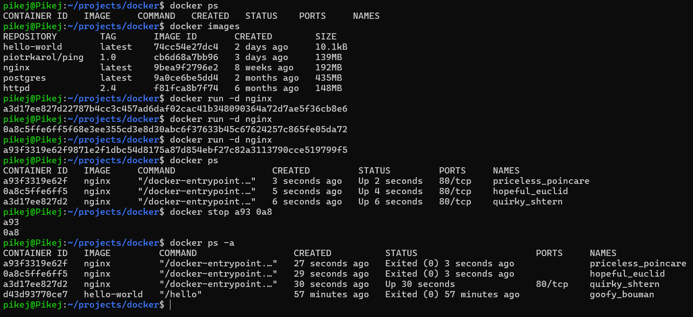
## Exercise 1.2
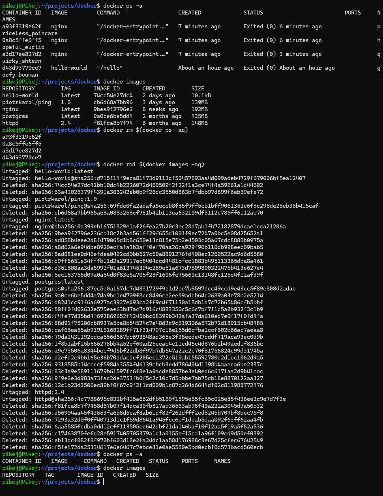
## Exercise 1.3
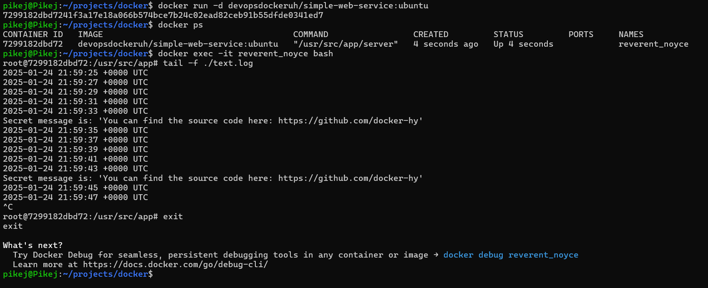
## Exercise 1.4
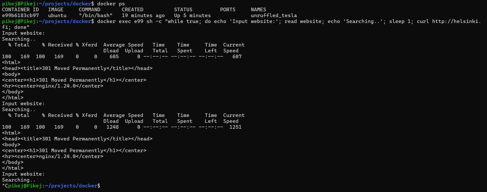
## Exercise 1.5
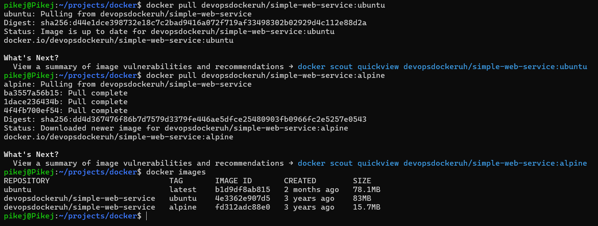
## Exercise 1.6
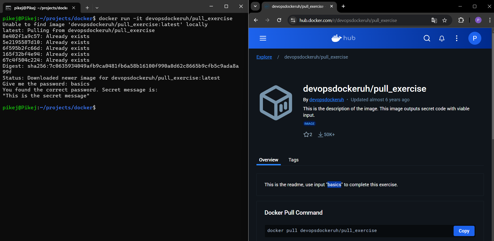
## Exercise 1.7
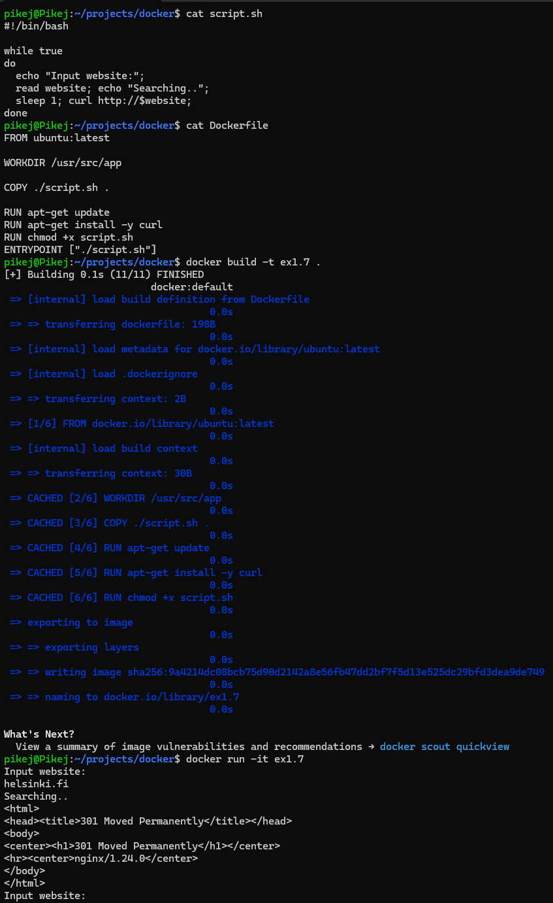
## Exercise 1.8
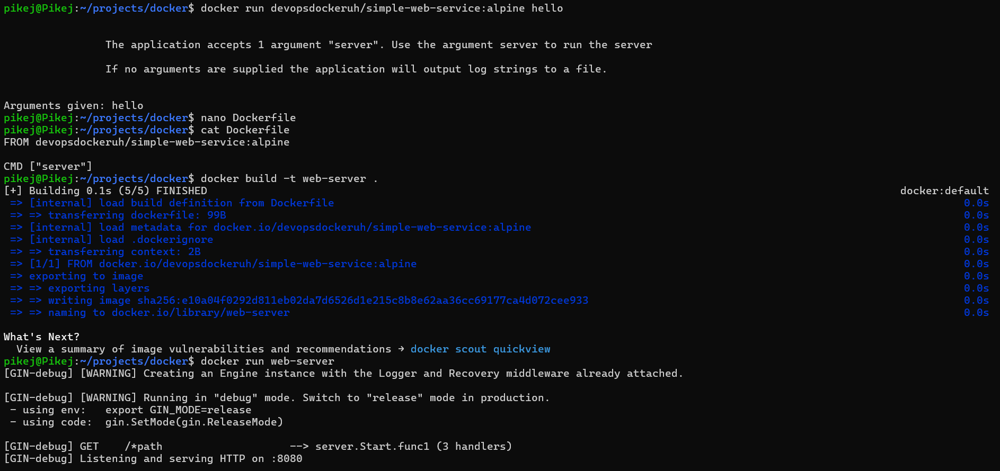
## Exercise 1.9
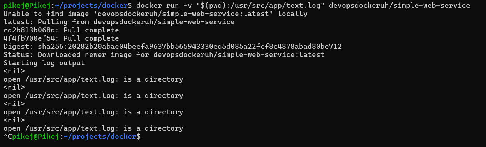
## Exercise 1.10
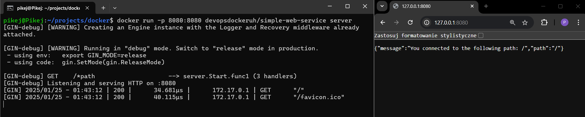
## Exercise 1.11
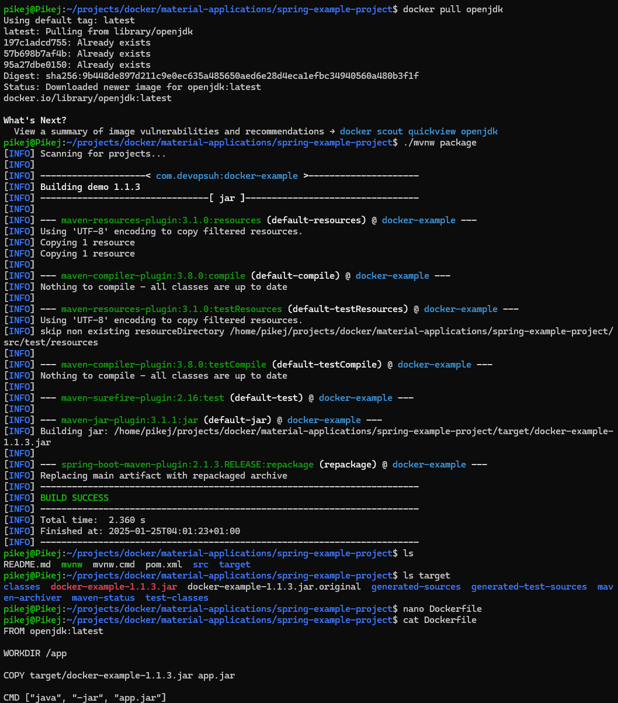
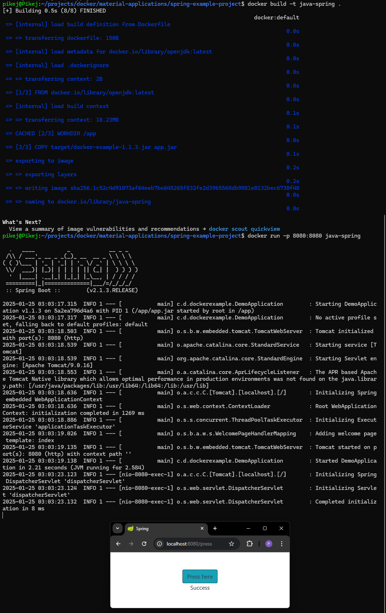
## Exercise 1.12
Note: instalacja node na systemie WSL była niezwykle uciążliwa, 
przez co projekt początkowo nie chciał się zbudować.
Zamiast tego ciągle pojawiały się błędy. 
Po wielu jednak godzinach i poradnikach w końcu udało się to zainstalować.
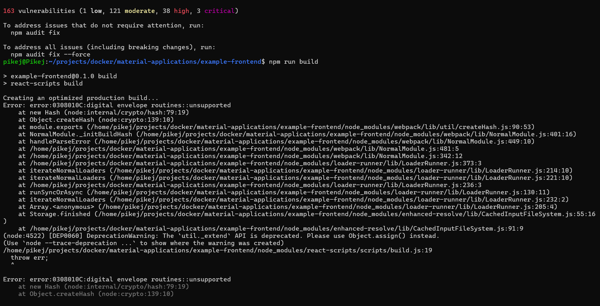
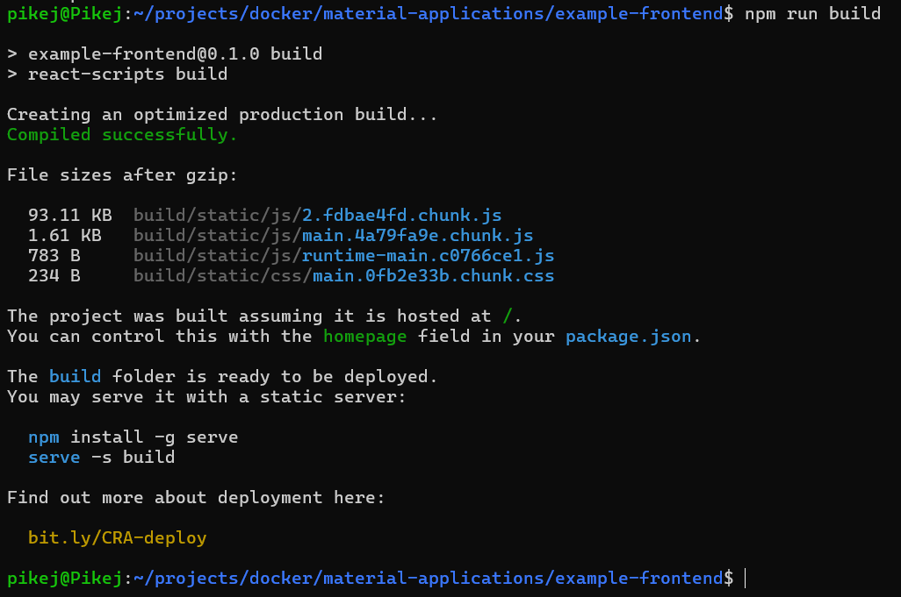
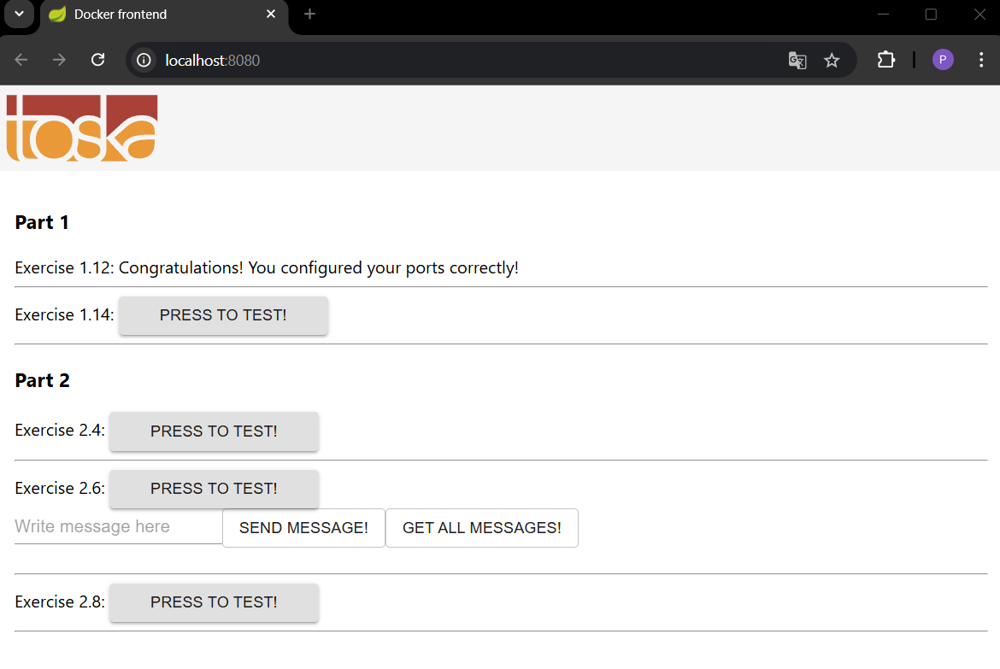
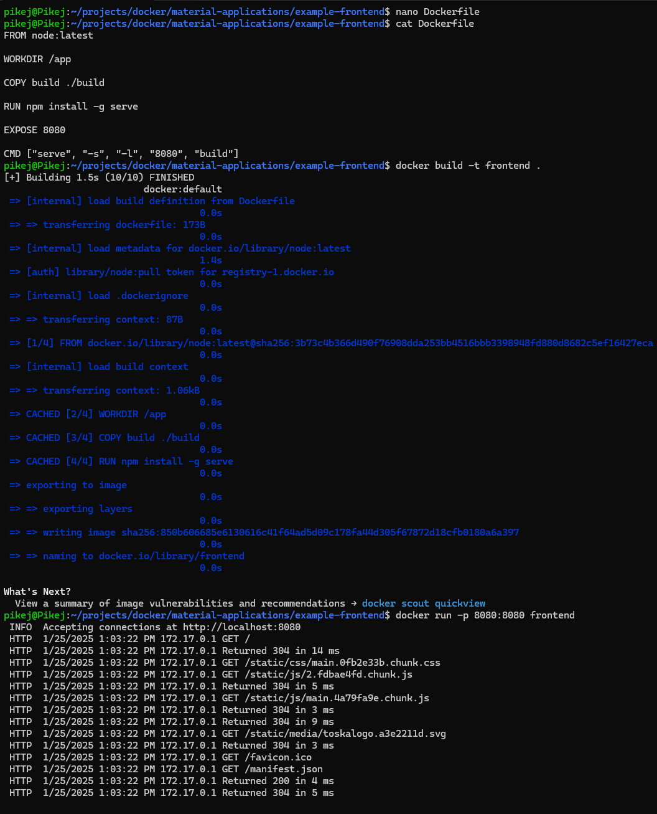
## Exercise 1.13
Note: Podobnie w przypadku instalacji go. 
Problem przede wszystkim polegał na tym, 
że apt-get instalował stare wersje oprogramowań.
Wypakowywanie archiwów tar z kolei czasem sprawiało, że brakowało kilku pakietów.
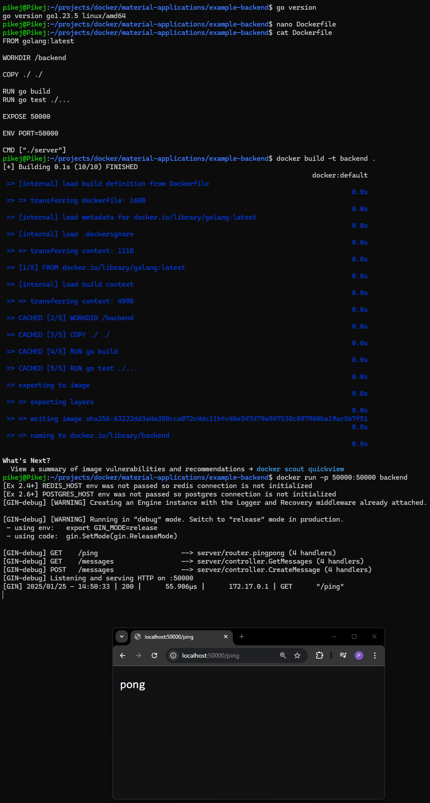

